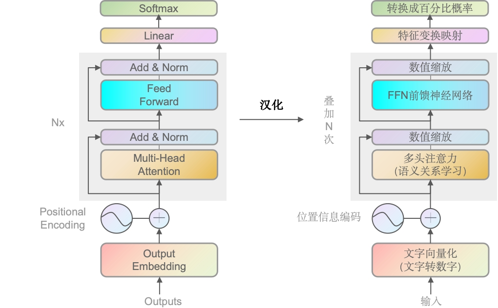

# 第一章——Transformer网络架构

### 总体架构图

左半边是编码器（Encoder），右半边是解码器（Decoder）。

这时候大家可能比较迷糊，为什么右边Decoder的部分也有输入（因为一般模型只有一个输出和一个输出），那是因为生成的过程中，模型还需要知道之前生成了哪些内容，以决定下一个最适合的输出。且两者都同时作用于训练和推理阶段。

### 左右如何配合运作

训练阶段：

- 编码器处理输入的序列（如源语音文本），并将其转化成一系列上下文相关的表示（**机器可读的表示形式**），用于捕获输入序列中的信息。
- 解码器使用编码器的输出以及目标序列的前缀（通过教师强制技术），来预测目标序列的下一个词或标记。在训练过程中，**解码器学习**如何根据编码器的输出和已知的目标序列前缀来生成正确的输出序列。

推理阶段（解码/生成阶段）：

- 编码器同样处理输入序列并产生上下文相关的表示（**机器可读的表示形式**）。
- 解码器则逐步生成输出序列。在每一步，它使用编码器的输出和到目前为止自己生成的序列来预测下一个词或标记。在推理时，解码器不再有访问真实目标序列的前缀，而是依赖于自己之前的预测来继续生成序列。

### 一定同时需要编码器和解码器吗？

根据我们上面了解到的，不同的部分其实可以针对不同的任务。

- BERT（Bidirectional Encoder Representations from Transformers）是只使用了编码器（Encoder）的模型，一般用于抽样式问答 或者 做命名实体识别，如从给定的文本段落中找到并提取出回答问题的文本片段。目标是识别或检索信息，而不是生成新的文本序列。
- GPT（Generative Pretrained Transformer）是只使用了解码器的模型，被设计用于生成文本。
- 机器翻译，则需要编码器处理源语言文本，解码器生成目标语言文本。即整个Transofmer。

### 解码器（Decoder）概述

> 由于现在GPT是最主流的方向，所以后续主要讲decoder，encoder的架构也跟decoder差不多，理解了decoder也就理解了encoder

通过上面的英文转中文，大家应该也能理解大致意思，也就是文字会向量化 加上 位置信息编码，输入到多头注意力机制里，去学习语义关系，通过数值缩放再到神经网络层。数值缩放后被线性映射，最后输出成百分比概率。

其中左侧的线（非主线），则是残差连接（借鉴Resent）。残差连接用以解决梯度消失/爆炸，和保留原始信息；

下面我们以简单讲述，来走一遍全部流程，后续章节再进行更深入的讲解。

### 文字向量化

如样本“我在搞懂大模型”，通过某种方法转换成数值后，假设为[12,31,172, ..., 52, 02]，再结合位置信息编码，假设为[1,2,3,4,5,6,7]。结合后通过三个不同的线性变换生产Q、K和V向量，每一份对应一个头，如GPT是12头，则是向量 × 3 × 12 份数据。

另外需要注意的是，每个子模块都会叠加N次，如GPT-3就据说叠加了175层。即最终是向量 × 3 × 12 × 175。