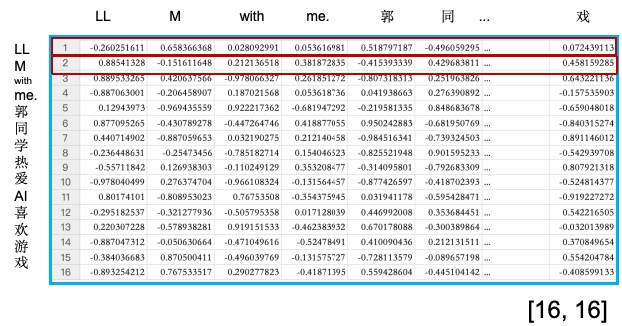

# 第四章——多头注意力机制——QK矩阵相乘

### 前言

上一章，我们已经研究了矩阵相乘以及QK相乘的过程，接下来我们完整的走一遍多头注意力机制里的流程。

### QK矩阵相乘

上面我们计算好了QK相乘后的矩阵，我们看下原文中的Attention公式
$$
\operatorname{Attention}(Q, K, V)=\operatorname{softmax}\left(\frac{Q K^{T}}{\sqrt{d_{k}}}\right) V
$$

我们单独拿1个批次的第一个头出来

第一行的所有数据，分别上`LL`分别跟`LLM with me.郭同学热爱AI喜欢游戏`每个词的相关性。第二行则是`M`分别跟`LLM with me.郭同学热爱AI喜欢游戏`每个词的相关性。越高则代表两个字的相关性越高，越低则代表两个字的相关性越低。

### Scale缩放

缩放层。缩放操作通常用于调整矩阵乘法的结果。在计算注意力分数之前，会将查询和键的矩阵乘法结果除以一个缩放因子，通常是键向量维度的平方根。可以看到上面的它的公式就是让QK矩阵去除以根号下的d_k，而d_k就是每个头的维度，即768除以12个头，得到64，d_k=64。

也就是下面这个表的每一个值都会除以64，相当于值会进行缩小。

### Mask遮挡

这里讲的是生成型任务如语言模型（例如GPT），Mask遮挡的目的是为了防止模型在预测下一个词时“偷看”到未来的信息。这种技术被称为因果遮挡（Causal Masking）或自回归遮挡。在GPT这样的自回归语言模型中，模型被训练为基于之前的词来预测序列中的下一个词。因此，遮挡确保模型在生成当前词时只能使用它之前的词，而不能使用它之后的词，这符合自然语言的生成过程。

将矩阵的上三角部分（包括对角线）填充为 `-inf`或者0。

训练的过程中（语言模型场景），是从前往后训练，然后去预测后面的词（句子），所以训练过程中，我们要遮挡一部分，让模型不知道后面的信息，自动去生成然后校验生成与实际之间的差距。

### Softmax归一化

将上面的值转成0到1直接的值，即百分比的概率分布。它会放大分数较高的元素，并抑制分数较低的元素。在注意力机制中，这意味着模型可以更加集中地关注那些与当前查询（Query）最相关的键（Key），从而获取对应的值（Value）。

Softmax函数的公式如下：
$$
\text{Softmax}(z_i) = \frac{e^{z_i}}{\sum_{j=1}^{K} e^{z_j}}
$$
这里就不做详解，你就简单理解为：它可以将一批值，转换为一个概率分布，其中每个元素的值介于0和1之间，并且所有元素的和为1。

可以看到`LL`对其它文本信息的概率总和是1，`M`对其它文本信息的概率总和也是1。以此类推，此时整个矩阵的形状是没有变的。

### QK与V矩阵相乘
